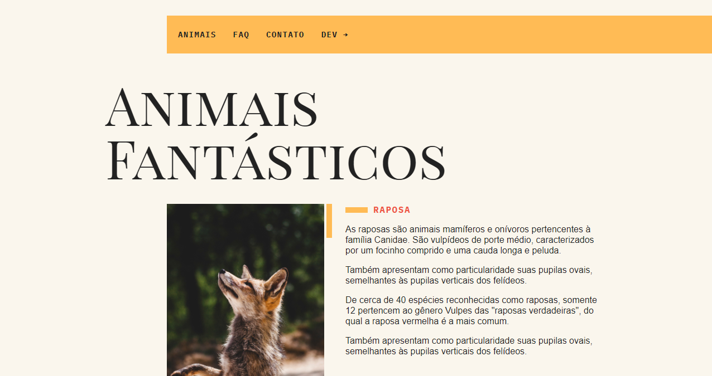

<h1 align="center">
    
</h1>

  <a href="#sobre">Sobre</a>&nbsp;&nbsp;&nbsp;|&nbsp;&nbsp;&nbsp;
  <a href="#interface">Interface</a>&nbsp;&nbsp;&nbsp;|&nbsp;&nbsp;&nbsp;
  <a href="#tecnologias">Tecnologias</a>&nbsp;&nbsp;&nbsp;|&nbsp;&nbsp;&nbsp;
  <a href="#executar">Requisitos</a>&nbsp;&nbsp;&nbsp;|&nbsp;&nbsp;&nbsp;
  <a href="#licença">Licença</a>&nbsp;&nbsp;&nbsp;|&nbsp;&nbsp;&nbsp;

---

### 🔖 Sobre

  <b>Animais Fantásticos</b> é um projeto voltado a preservação dos animais, destacando de maneira ilustrativa algumas espécies.

    Este projeto foi construído como base para prática do curso de Javascript ES6 da Origamid

---

### 🚀 Tecnologias

- [Javascript](https://www.javascript.com/)

---

### 📝 Licença

Esse projeto possui a licença MIT. Veja no arquivo [LICENSE](LICENSE) para mais informações.

---

**Feito com 💙 por [Victor Hugo](https://github.com/itsmevictorhugo).**
